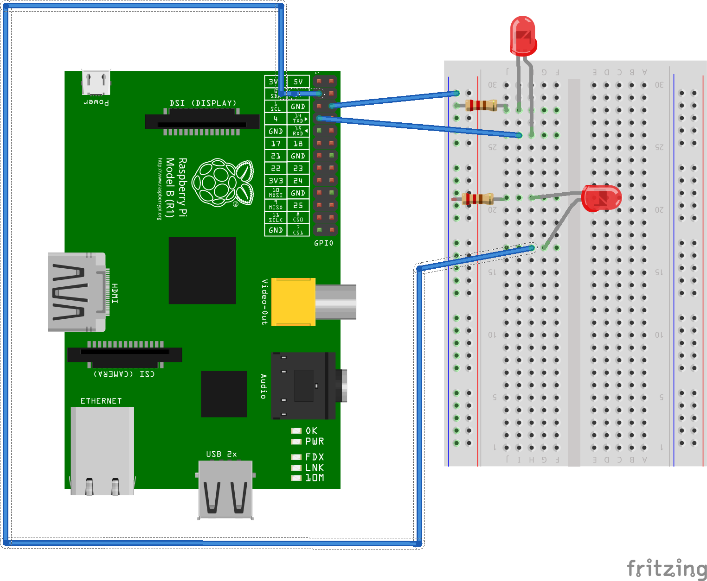

# Getting started with Python

Python is an interpreted, high level language that emphasises on the code
readability and its functions rather than the syntax. It also has a lot of
built-in methods and tools that allow programmers to express their code in very
less lines of code. For this reason, it has been widely used for various
purposes. It is also supported by the open source community and because of this,
you will find modules for everything right from email fetching to complex tasks
like image recognition.

Raspberry Pi can be programmed using the Python language as well as the new,
feature rich Wolfram language.

#### Basics of Python

The customary starting point of learning any programming language: Printing
'hello world!'

    print 'hello world!'

    hello world!

In Python, you don't have to worry about memory allocation or specifying the
data type of variables unlike commonly used languages like C, C++ and Java. This
makes it easy for beginners and experts to concentrate on their code
functionality. Also, Python uses indentation to specify blocks(instead of
semicolons and brackets).

    a = 10

    print type(a) #type() returns the type of the variable.

    <type 'int'>

    b = 10.01

    print type(b)

    <type 'float'>

    c = 'python'

    print type(c)

    <type 'str'>

    d = 'p'

    print type(d)

    <type 'str'>

Note that, in Python, string and character are not different data types.

    listExample = [1, 2, 3] #list is the Python equivalent of arrays in C, C++, etc.

The only difference is that, in Python, lists can be heterogeneous in nature.
That is, a list's can have elements of different data types.

    listExample = [1, 'a', 1.9]

The variable's data type can also be changed when necessary.

    integer = 5

    print type(integer)

    <type 'int'>

    integer = 'changing the type'

    print type(integer)

    <type 'str'>

#### Getting input from the user

    variable =  raw_input() 

    8

    print type(variable)

    <type 'str'>

Note that the raw_input() function stores values as strings by default.

To change this, use the following built in methods.

    variable = int(raw_input())

    6

    print type(variable)

    <type 'int'>

    variable = float(raw_input())

    8

    print variable, type(variable)

    8.0 <type 'float'>

Note that, the print function can be used to print multiple values by separating
them with a comma.

To display a prompt to the user while getting input, specifying the prompt
string like:

    a = raw_input("Enter your name")

    Enter your nameEnsemble Tech

    a

    'Ensemble Tech'

#### Some commonly used built-in methods

    list = [1, 3, 5, 2, 4, 1]

    list.count(1) #the count of the element 1 in the list

    2

    list.sort() #sorts the list

    list #the list has been sorted

    [1, 1, 2, 3, 4, 5]

    list.append(6) #add an element to the end of the list.

In Python, a string is basically a list of characters. For this reason, list
methods can also be used for strings. There are also some extra methods.

    string = "this is an example"

    string.capitalize() #capitalizes the first letter of the string

    'This is an example'

    string = 'single quotes can also be used'

But make sure that you don't use ' and " together. For example,

    dontDoThis = 'look at the error"

      File "<ipython-input-23-1868471ea474>", line 1
        dontDoThis = 'look at the error"
                                       ^
    SyntaxError: EOL while scanning string literal

#### Loops and conditions

If, if..else, nested if:

    if True:
        print 'this'

    this

    if False:
        print 'hello'
    else:
        print 'hello world'

    hello world

    a = 5

    if a > 5:
        print 'this computer is very poor at Math'
    else:
        print 'Come on! Even a kid can say this'

    Come on! Even a kid can say this

Nested if is achieved by using elif statements.

    #this example uses whatever we have learnt till now
    #can you guess the output without scrolling down?
    userInput = int(raw_input("Enter something"))
    inType = type(userInput)
    if inType == str: #== is used for checking equality. Use = only for assignment
        print "you entered a string" #or maybe you forgot to cast it to the required type. Use int() or float()
    elif inType == float:
        print "you entered a float value"
    elif inType == list:
        print "that is a list"
    else:
        print "This is an integer." #properly typed because this is the right output.

    Enter somethingsomething

    ---------------------------------------------------------------------------
    ValueError                                Traceback (most recent call last)

    <ipython-input-31-2d0aa59e6b53> in <module>()
          1 #this example uses whatever we have learnt till now
          2 #can you guess the output without scrolling down?
    ----> 3 userInput = int(raw_input("Enter something"))
          4 inType = type(userInput)
          5 if inType == str: #== is used for checking equality. Use = only for assignment

    ValueError: invalid literal for int() with base 10: 'something'

No, I was cheating. You can't convert a string to an integer unless it has only
numbers. For example, you can change '9898' to a string but changing 'asdasdsad'
to a number is not possible.

    #this example uses whatever we have learnt till now
    #can you guess the output without scrolling down?
    userInput = int(raw_input("Enter something: "))
    inType = type(userInput)
    if inType == str: #== is used for checking equality. Use = only for assignment
        print "you entered a string" #or maybe you forgot to cast it to the required type. Use int() or float()
    elif inType == float:
        print "you entered a float value"
    elif inType == list:
        print "that is a list"
    else:
        print "This is an integer." #properly typed because this is the right output.

    Enter something: 123
    This is an integer.

#### Loops:

For loop: Uses range() and xrange() to iterate through a series of values.

    range(1, 10) #series of values from 1 upto 10(excluding 10)

    [1, 2, 3, 4, 5, 6, 7, 8, 9]

    xrange(1, 10)

    xrange(1, 10)

The difference between range() and xrange() is beyond the scope of Python
application in RPi. However, in brief, use range() in situations where you need
the values in the series(like printing numbers from 1 to 100). Use xrange() when
you don't need the values(like printing hello world 100 times). You can use any
of the two but using them according to the above guidelines will result in an
optimised code.

    for number in range(2):
        print number

    0
    1

Note that the arguments of both range() and xrange() is of the form
(x)range(start, stop[, step]). Here the stop parameter is mandatory. The start
parameter is 0 by default. step parameter allows you to go through the list in
increments. For example,

    range(0, 10, 2) #note that the start parameter is needed if a step is provided.

    [0, 2, 4, 6, 8]

    a = 5
    while a < 10:
        print a
        a += 1 #the increment and decrement operators are not present in Python

    5
    6
    7
    8
    9

Python doesn't provide a switch case construct. Use nested if(with elif) when
necessary.

#### User defined methods

The basic syntax is :

def functionName(optional, parameters, if, needed):
    the function
    does this

    def evenCheck(number):
        if (number % 2) == 0:
            return True
        else:
            return False
    
    def anotherImplementation(number):
        if (number % 2) == 0:
            return "even"
        else:
            return "odd"
    
    for testCase in xrange(2): 
        n = int(raw_input())
        if evenCheck(n):
            print "the number is even"
        else:
            print "the number is odd"
            
        result = anotherImplementation(n)
        print "The number is " + result #string concatenation can be done with the + operator
        print "The number %d is %s" %(n, result)

    3
    the number is odd
    The number is odd
    The number 3 is odd
    4
    the number is even
    The number is even
    The number 4 is even

### Raspberry Pi with Python

In combination with the above mentioned Python basics, you can use the RPi.GPIO
module to program the GPIO pins of the Raspberry Pi. This module is already
available in RPi so you don't have to install it. If you need any additional
modules, launch the terminal in the RPi and use the command sudo pip install
moduleName

    import RPi.GPIO as GPIO #imports the module. using the 'as GPIO' makes it possible to use all the 
                            #module components as GPIO.something instead of RPi.GPIO.something

The following are some basics. An extensive documentation can be found here:
http://pythonhosted.org/RPIO/

    GPIO.setmode(GPIO.BOARD) #sets the numbering scheme according to the board
    GPIO.setwarnings(False)  #sets warnings to false. cleaner ouput.
    GPIO.setup(7, GPIO.OUT)  #set pin 7 as output
    GPIO.output(7, True)     #Set the output as true. In simple terms, light on
    GPIO.output(7, False)    #sets the output to false. In simple terms, light off
    GPIO.cleanup()           #reset every channel that has been set up by this program,
                             # and unexport interrupt gpio interfaces

Make sure you don't use the wrong pins. This image from http://www.raspberrypi-
spy.co.uk/2014/07/raspberry-pi-b-gpio-header-details-and-pinout/ should give you
an idea of what to use and what not to use.

Here is a simple program to turn on an LED.

    import RPi.GPIO as GPIO
    import time
    
    GPIO.setmode(GPIO.BOARD)
    GPIO.setwarnings(False)
    GPIO.setup(7, GPIO.OUT)
    
    GPIO.output(7, True)
    time.sleep(3)
    GPIO.output(7, False)

This program turns on the LED, keeps it on for 3 seconds and then turns it off.

To make the LED blink at specific time intervals(say blink thrice. once in every
two seconds)

    import RPi.GPIO as GPIO
    import time
    
    GPIO.setmode(GPIO.BOARD)
    GPIO.setwarnings(False)
    GPIO.setup(7, GPIO.OUT)
    
    for blink in xrange(3):
        GPIO.output(7, True)
        time.sleep(0.5)
        GPIO.output(7, False)
        time.sleep(2)

To do the same with multiple LEDS,

    #one led blinks, then the next..waits 
    #for two seconds and then repeats it.
    
    import RPi.GPIO as GPIO
    import time
    
    GPIO.setmode(GPIO.BOARD)
    GPIO.setwarnings(False)
    GPIO.setup(3, GPIO.OUT)
    GPIO.setup(7, GPIO.OUT)
    
    for blink in xrange(3):
        GPIO.output(7, True)
        time.sleep(0.5)
        GPIO.output(7, False)
        GPIO.output(3, True)
        time.sleep(0.5)
        GPIO.output(3, False)
        time.sleep(2)

To do the same with a user input for the number of times and the blink duration,
use the following code.

    import RPi.GPIO as GPIO
    import time
    
    #turns on and blinks an LED for a number of times
    #specified by the user.
    
    GPIO.setmode(GPIO.BOARD)
    GPIO.setwarnings(False)
    GPIO.setup(7, GPIO.OUT)
    
    try:
        noOfTimes = int(raw_input("Enter the number of blinks"))
    except:
        print 'Please enter an integer value'
    
    try:
        blinkDuration = float(raw_input("Enter the duration of the blinks"))
    except:
        print 'Please enter a number'
    
    for n in xrange(noOfTimes):    
        GPIO.output(7, True)
        time.sleep(blinkDuration)
        GPIO.output(7, False)
        time.sleep(blinkDuration)

Here is a simple program to control LED in a Rasberry Pi using your voice

This uses SL4A, a scripting tool for Android with Python for Android enabled in
it. The setup is pretty easy and straightforward. Along with it, use the
following commands in your RPi to install the required modules.

`sudo apt-get python-pip`

`sudo pip install pygmail`

Enter the following command in your SL4A interpreter

    import os
    import glob
    import mimetypes 
    from email import encoders
    from email.mime.audio import MIMEAudio
    from email.mime.base import MIMEBase
    from email.mime.image import MIMEImage
    from email.mime.multipart import MIMEMultipart
    from email.mime.text import MIMEText
    
    def attach_files(msg, attachements):
      for attachment in attachments:
        attachment = attachment.strip()
        for path in glob.glob(attachment):
          filename = os.path.basename(path)
          if not os.path.isfile(path):
            continue
          # Guess the content type based on the file's extension.  Encoding
          # will be ignored, although we should check for simple things like
          # gzip'd or compressed files.
          ctype, encoding = mimetypes.guess_type(path)
          if ctype is None or encoding is not None:
            # No guess could be made, or the file is encoded (compressed), so
            # use a generic bag-of-bits type.
            ctype = 'application/octet-stream'
          maintype, subtype = ctype.split('/', 1)
          if maintype == 'text':
            fp = open(path)
            # Note: we should handle calculating the charset
            part = MIMEText(fp.read(), _subtype=subtype)
            fp.close()
          elif maintype == 'image':
            fp = open(path, 'rb')
            part = MIMEImage(fp.read(), _subtype=subtype)
            fp.close()
          elif maintype == 'audio':
            fp = open(path, 'rb')
            part = MIMEAudio(fp.read(), _subtype=subtype)
            fp.close()
          else:
            fp = open(path, 'rb')
            part = MIMEBase(maintype, subtype)
            part.set_payload(fp.read())
            fp.close()
            # Encode the payload using Base64
            encoders.encode_base64(part)
          # Set the filename parameter
          part.add_header('Content-Disposition', 'attachment', filename=filename)
          msg.attach(part)
    
    def sendemail(email_name, email_user, email_pswd, mailto, subject, body, attachments):
      import smtplib
    
      # DON'T CHANGE THIS!
      # ...unless you're rewriting this script for your own SMTP server!
      smtp_server = 'smtp.gmail.com'
      smtp_port = 587
    
      # Build an SMTP compatible message
      msg = MIMEMultipart()
      msg['Subject'] = subject
      msg['To'] = mailto
      msg['From'] = email_name + " <" + email_user + ">"
      msg.attach(MIMEText(body, 'plain'))
      attach_files(msg, attachments)
    
      # Attempt to connect and send the email
      try:
        smtpObj = '' # Declare within this block.
        # Check for SMTP over SSL by port number and connect accordingly
        if( smtp_port == 465):
          smtpObj = smtplib.SMTP_SSL(smtp_server,smtp_port)
        else:
          smtpObj = smtplib.SMTP(smtp_server,smtp_port)
        smtpObj.ehlo()
        # StartTLS if using the default TLS port number
        if(smtp_port == 587):
          smtpObj.starttls()
          smtpObj.ehlo
        # Login, send and close the connection.
        smtpObj.login(email_user, email_pswd)
        smtpObj.sendmail(email_user, mailto, msg.as_string())
        smtpObj.close()
        return 1  # Return 1 to denote success!
      except Exception, err:
        # Print error and return 0 on failure.
        print err
        return 0
    
    import sys
    import android
    
    droid = android.Android()
    
    email_name = "Your Name"
    email_user = "emailid@gmail.com"
    email_pswd = "password"
    mailto = "emailid@gmail.com"
    subject = "LED"
    attachments = ''
    
    body = droid.recognizeSpeech().result
    
    
    if (sendemail(email_name, email_user, email_pswd, mailto, subject, body, attachments)):
          sys.exit(0)
    else:
          droid.makeToast("Failed to send email")
      

And save the following code in your Raspberry Pi

    import gmail
    import RPi.GPIO as GPIO
    import time
    
    GPIO.setmode(GPIO.BOARD)
    GPIO.setwarnings(False)
    GPIO.setup(7, GPIO.OUT)
    
    print 'authenticating. please wait'
    
    g = gmail.login('username', 'password')
    while True:
    	commandMails = g.inbox().mail(unread = True, sender = 'sourceEmailgmail.com', subject = 'LED')
    	try:	
    		commandMails[0].fetch()
    		command = commandMails[0].body.lower()
    		commandMails[0].delete()
    		if 'light' in command or 'lite' in command:
    			if 'on' in command:
    				GPIO.output(7, True)
    			if 'off' in command or 'of' in command:
    				GPIO.output(7, False)
    		else:
    			pass
    	except:
    		time.sleep(10)

Run both the codes and see the magic. You can easily modify this code to control
more than one LED. By adding a few more if..elif..else or the more complex set
intersection approach, you can create something like a home automation system.

### The next level of RPi projects...

Till now, we have only seen how to control the RPi using the internet. We used
an email based approach which may not be effective all the time. A better
approach would be to use the RPi's networking capabilities and use some other
device connected to the same local network that the RPi is in to control the
GPIO pins.

You can use either Python or nodeJS(a Javascript based runtime environment for
server-side and networking applications).

Here is a Python based approach.

We will be using lighttpd to run a server on the Raspberry Pi. To install
lighttpd, use

`sudo apt-get install lighttpd`

Now open the file browser in your RPi and type this in the address bar:

`/var/www/`

Create an index.html with contents according to your wish.

<html>
  <head>
    <title>Ensemble Tech</title>
  </head>
  <body>
    <h1>Hello World!</h1>
  </body>
</html>

If you are not able to create this file, use the following commands after
starting the terminal.

`cd /var/www/`

`chmod -R 777`

and then create the index.html file.

To test this, open the terminal and run

`sudo service lighttpd start`

Now using any device that is connected to the same local network that the RPi is
in, open a web browser of your choice and type the IP address of the RPi in the
address bar. You can find this using the `ip addr show` command. If all goes
well(it usually does if you have followed the instructions), you will be able to
see the index file you had created previously.

We will using FastCGI to run our Python program on the server. To install, use

`sudo apt-get install python-flup`

Create the following file in the /var/www/ path and change its permissions to
755. Use `chmod -R led.py` . Note that you can give any file name but remember
this for later use.

    #!/usr/bin/pythonRoot
    import RPi.GPIO as GPIO     
    from flup.server.fcgi import WSGIServer 
    import sys
    import urlparse
     
    # set up our GPIO pins
    GPIO.setmode(G.BOARD)
    GPIO.setup(7, GPIO.OUT) #use any GPIO pin
     
    
    def app(environ, start_response): 
      start_response("200 OK", [("Content-Type", "text/html")])
      i = urlparse.parse_qs(environ["QUERY_STRING"])
      yield ('&nbsp;')
      if "led" in i:
        if i["led"][0] == "on": 
          GPIO.output(7, True)   # Turn it on
        elif i["led"][0] == "off":
          GPIO.output(7, False)  # Turn it off
     
    WSGIServer(app).run()

We need to run Python for this script. However, doing so with default settings
will result in security issues as you will have to provide sudo rights to
control GPIO with Python. To avoid this,

ls -l /usr/bin/python

Note the version of your Python from the result of the above command. Use that
version number(for eg. if it is 2.7) as

sudo cp /usr/bin/python2.7 /usr/bin/pythonRoot
sudo chmod u+s /usr/bin/pythonRoot

Go to the directory /etc/lighttpd in the file browser and change the file
permissions as mentioned earlier. This is to enable editing of the lighttpd.conf
file.

Open the lighttpd.conf file and add mod_fastcgi to the server.modules list.

Then, add this to the conf file at the end.

fastcgi.server = (
   ".py" => (
     "python-fcgi" => (
       "socket" => "/tmp/fastcgi.python.socket",
       "bin-path" => "/var/www/doStuff.py",
       "check-local" => "disable",
       "max-procs" => 1)
    )
 )

To test this, you will have to restart the server. To do so, use any of the two
following techniques(the former is an obviously better approach):

`sudo service lighttpd restart`
 Or 
`sudo service lighttpd stop`
 
`sudo service lighttpd start`

If you open the same address in your browser(192.168.0.32 in my case), you will
see the same index.html. Now do the following in the URL. 
192.168.0.32/led.py?led=on
 The LED will now turn on. 
192.168.0.32/led.py?led=off
 The LED will now turn off. 

To modify the same and use it for multiple LEDs,

    #!/usr/bin/pythonRoot
    
    import RPi.GPIO as GPIO     
    from flup.server.fcgi import WSGIServer 
    import sys
    import urlparse
    
    # set up our GPIO pins
    GPIO.setmode(GPIO.BCM)
    GPIO.setup(4, GPIO.OUT) #use any GPIO pin
    GPIO.setup(2, GPIO.OUT)
    
    
    def app(environ, start_response): 
      start_response("200 OK", [("Content-Type", "text/html")])
      i = urlparse.parse_qs(environ["QUERY_STRING"])
      yield ('&nbsp;')
      if "status" in i:
    	if i["status"][0] == "1on":
    		GPIO.output(4,True)
    	if i["status"][0] == "1off":
    		GPIO.output(4,False)
    	if i["status"][0] == "2on":
    		GPIO.output(2,True)
    	if i["status"][0] == "2off":
    		GPIO.output(2,False)
    		
    
    WSGIServer(app).run()

    <html>
     <head>
        <title>We made it work</title>
      	 
      </head>
      <body>
        <h1>We made it work :D</h1>
        <form>
        	<input type="button" value="LED 1 On" onclick="go('1on')" style="font-size:200%;"> 
        	<input type="button" value="LED 1 Off" onclick="go('1off')" style="font-size:200%;"> 
    	<input type="button" value="LED 2 On" onclick="go('2on')" style="font-size:200%;"> 
        	<input type="button" value="LED 2 Off" onclick="go('2off')" style="font-size:200%;">
        </form>
        
      </body>
    </html>

    
